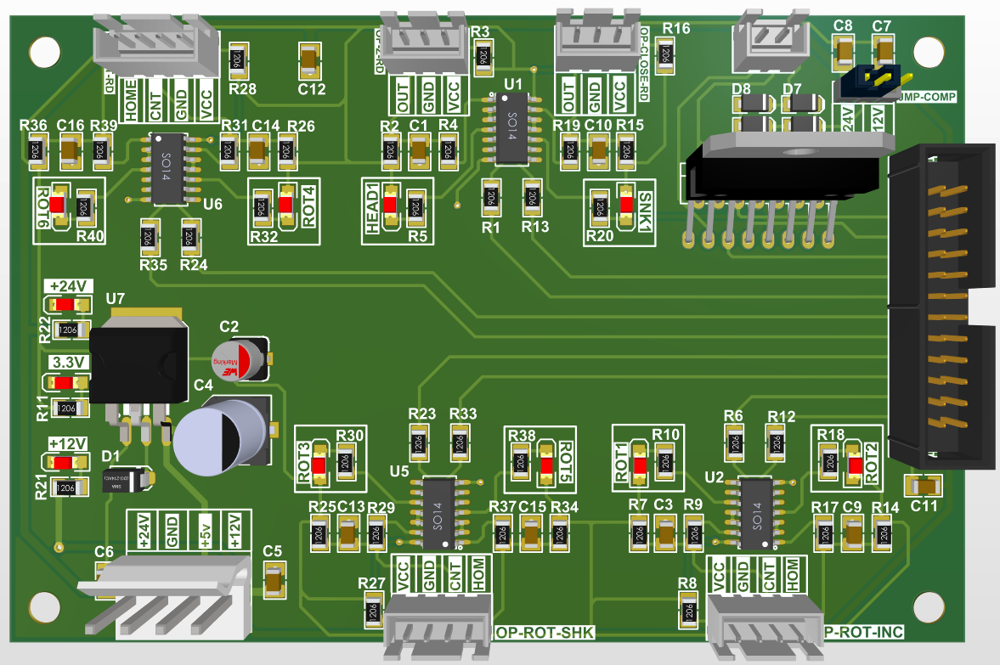
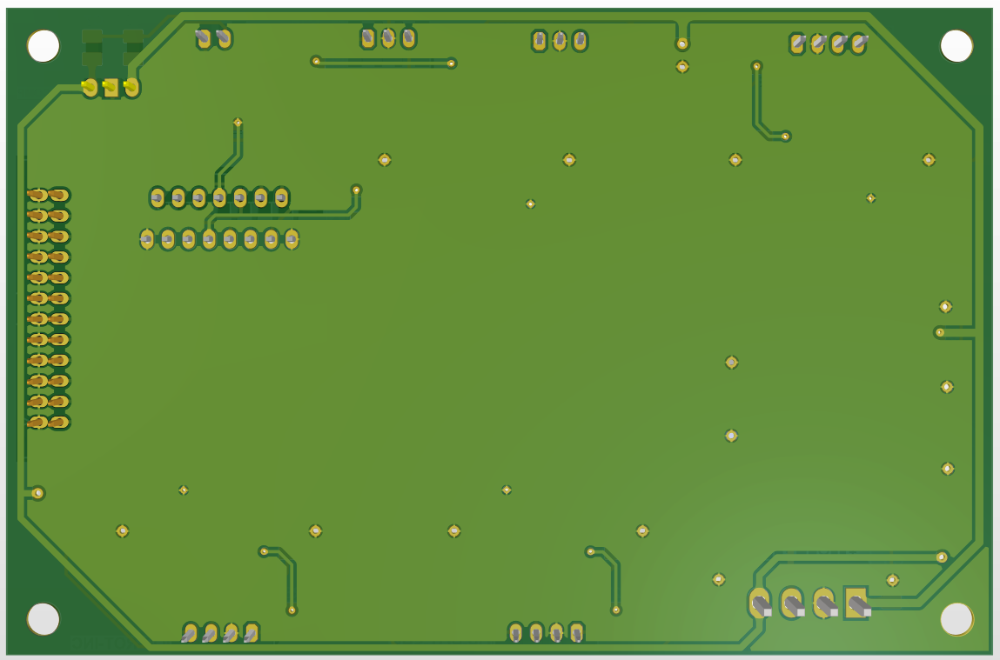
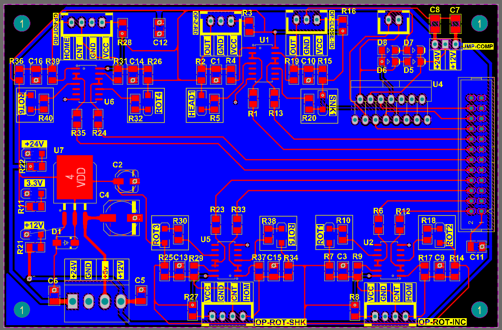
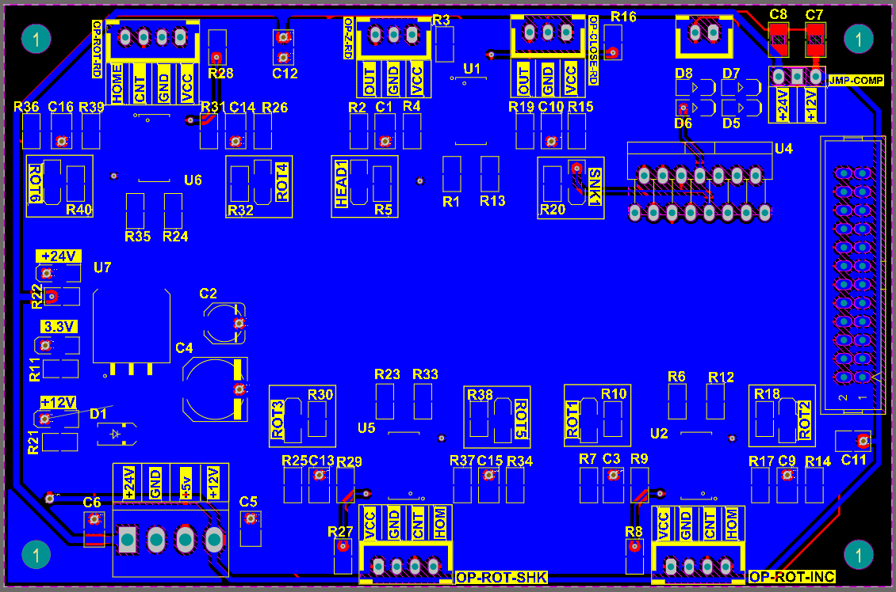

# Microplate Reader & Analyzer Controller Board

## 📌 Overview
The **Microplate Reader & Analyzer Controller Board** is a precision measurement, positioning, and optical feedback control PCB engineered for automated ELISA microplate readers and laboratory diagnostic analyzers.

### Key Features:
- **Motion Control & Position Sensing Channels:**
  - `OP-ROT-RD` / `OP-ROT-SHK` / `OP-ROT-INC`: Multi-channel optical encoder and positioning interfaces for reading mechanisms, plate shaking, and incubator transport.
  - `OP-CLOSE-RD` & `OP-Z-RD`: Door closing, limit switching, and Z-axis optical alignment feedback.
- **Signal Conditioning & Processing Circuits:**
  - High-precision operational amplifiers (`U1`, `U2`, `U5`, `U6` in `SO-14` packages) for sensor signal amplification and filtering.
  - Dedicated diagnostic status LEDs (`ROT1`–`ROT6`, `HEAD1`, `SNK1`).
- **Power Management & Drive Capabilities:**
  - Onboard voltage regulation (`U7`) providing multi-rail supply power (`+24V`, `+12V`, `+5V`, `+3.3V`, `GND`).
  - Solenoid / Actuator driver stage (`U4`) with power jump configurations (`JMP-COMP`).
  - High-density IDC system header for central control bus communication.

---

## 📂 Repository Structure

- 📄 [READER&SHAKE-MAIN-schematics.pdf](READER%26SHAKE-MAIN-schematics.pdf) — Full Circuit Schematic Diagram
- 📊 [BOM-READER&SHAKE-MAIN.xlsx](BOM-READER%26SHAKE-MAIN.xlsx) — Complete Bill of Materials (Component List)
- 🖼️ [3d_top_view.png](3d_top_view.png) — 3D PCB Render (Top View)
- 🖼️ [3d_bottom_view.png](3d_bottom_view.png) — 3D PCB Render (Bottom View)
- 🖼️ [pcb_layout_top.png](pcb_layout_top.png) — PCB Top Layer Copper & Silkscreen
- 🖼️ [pcb_layout-bottom.png](pcb_layout-bottom.png) — PCB Bottom Layer Copper & Silkscreen

---

| Schematic Diagram | Bill of Materials (BOM) |
| :--- | :--- |
| 📄 [Download Schematic PDF](READER%26SHAKE-MAIN-schematics.pdf) | 📊 [View Bill of Materials (BOM)](BOM-READER%26SHAKE-MAIN.xlsx) |

---

## 🖼️ Visuals

### 3D Model Render

| Top View | Bottom View |
| :---: | :---: |
|  |  |

### PCB Layout Design

| Top Layer | Bottom Layer |
| :---: | :---: |
|  |  |
